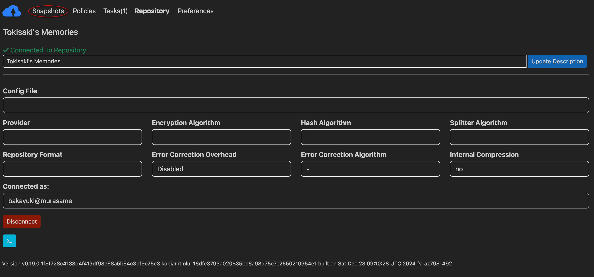
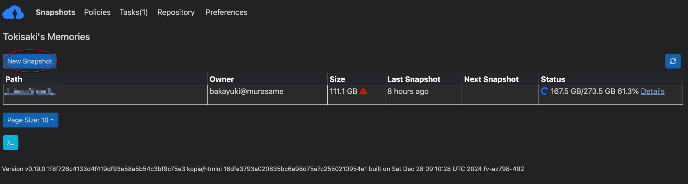
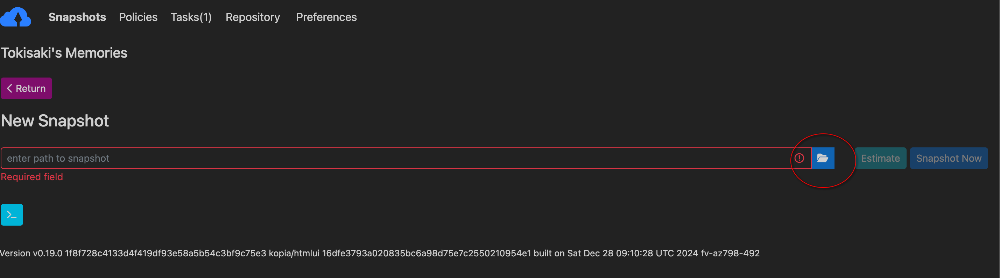
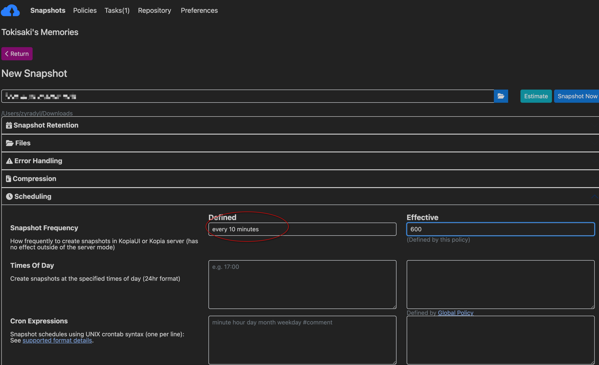

# Creating Snapshots

Kopia refers to paths that should be backed up as "Snapshots". By default,
snapshots are recursive, so the directory you select and all of its contents
will be backed up. You can have as many, or as few, snapshots as you would like
per computer.

Snapshots can even be external media or network locations, however in the event
that the media is disconnected, Kopia will report that snapshot has having
errored.

## Creating a new Snapshot

To get started, make sure you are in the "Snapshots" area of the UI by clicking
the "Snapshots" button at the top of the GUI.

Once in this window, click the new snapshot button to begin.

You can then click the folder icon to open up your operating system's native
file browser to point to the location you want to backup.

Once you select a path, the policy editor will load in. The global policy is
likely a good place to start for general purpose backups. In the future there
will be a more detailed guide on modifying policies, but for now please look
through the GUI options and read the descriptions for more information.

In the below example, we override the Snapshot Frequency on the Global Policy
to ensure this path gets backed up every 10 minutes.

Finally, click "Snapshot Now" to begin your backup.

## Important information

Kopia will automatically create checkpoints as it performs snapshots.
Additionally, Tokisaki is configured to NEVER discard incomplete snapshots
until after one complete snapshot is performed. This means that even if your
internet disconnects, or you decide to halt your initial upload for a while,
you will be able to resume from where you left off without having to reupload
the same data.

However, because Kopia will automatically start from the beginning each time,
and only skip over unmodified files, it may appear as if a subsequent snapshot
is starting over. Please rest assured that redundant data will not be uploaded,
and your snapshots will become faster over time as the server copy more
accurately reflects your local storage.
