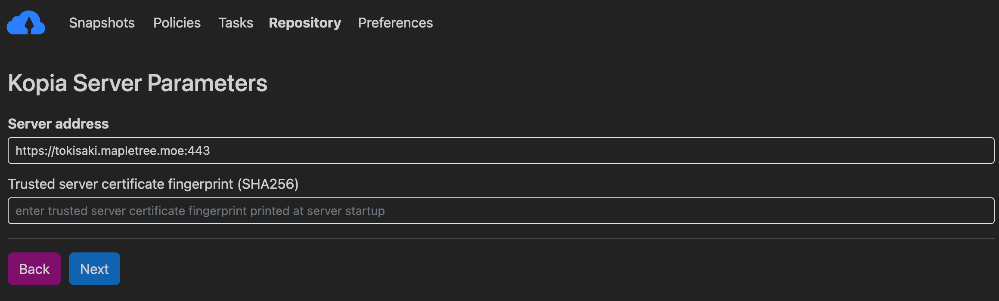

# Getting Started

To use Tokisaki you must first download the Kopia client and configure it. It
is also **highly recommended** that you change your password.

## Installing the Kopia Client

You can get started by downloading the client for your operating system from
the [official Kopia website][1]. For desktops it is advised to use the GUI
version, and for servers the CLI is recommended. If you would like to use a web
interface on your server, please refer to the Kopia documentation or ask Yuki
for assistance.

## Configuring Kopia

When you first open the GUI you will be prompted to connect to a repository. To
connect to Tokisaki, click on the "Kopia Repository Server" option.


You will then need to input the address to connect to Tokisaki. Please input
`https://tokisaki.mapletree.moe:443`. **You must include the `:443`.** See
the screenshot below.



You will then need to enter your password. **You must ensure the value in the
"Connect As" bar matches a valid account that was registered for you by a
Tokisaki administrator.** To change the information in that bar, click "Show
advanced options" as seen below. I personally recommend changing the repository
description to "Tokisaki's Memories" to keep with the theme of the project
name, however you can set it to whatever you would like.


You can modify your username and hostname using the boxes under advanced
options to ensure that it matches a valid Tokisaki account. You will only need
to do this the first time you log in. Once this is complete, enter the password
**given to you by a Tokisaki administrator.** We will change your password in
a future step. Then click "Connect to Repository" and Kopia will initialize the
connection to Tokisaki.


Once connected, please read below on how to change your password.

## Changing your password

***WARNING: Ensure you have your password saved in a safe location. If you
forget your password you will need to have an administrator recreate your
account and migrate all your previous snapshots to the new account. As two
connection strings cannot be identical, this will mean modifying the hostname
on the new account, for example username@computer2 instead of
username@computer. Migration will require you to consent to allowing an
administrator access to your snapshots. If you do not wish to do this, your
account can be deleted and recreated. Since no data will be lost, your first
snapshot will be much faster, but you will lose access to your historical
snapshots.***

**NOTE:** While Kopia should automatically persist the new password into your
credentials, there is a chance you will need to log in to the UI again.

### Linux

As linux packages come bundled with the cli and gui by default, you only need
to open a terminal and run the following command:

```
kopia server users set <USERNAME@HOSTNAME> --ask-password
```

### MacOS

The MacOS application includes the Kopia CLI client, but the resulting command
is much longer. You will need to open the terminal.

```
/Applications/KopiaUI.app/Contents/Resources/server/kopia server users set <USERNAME@HOSTNAME> --ask-password
```

### Windows

I unfortunately don't have access to Windows. Once a windows user reaches this
step, please contact me for assistance guiding you through this process, after
which it will be added to the documentation.

[1]: https://kopia.io/docs/installation/#kopia-download-links
